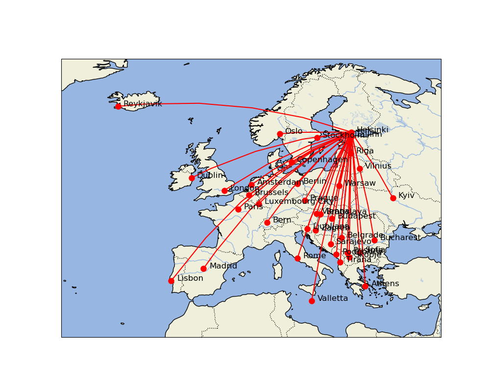

# Great Circles

Draw a map with great circle routes from a location to a list of targets. An example below, more in [examples.py](examples.py).

```
import matplotlib.pyplot as plt

from distance_plotter import plot_distances, distance_table
from place_coords import *

location = { "Helsinki": europe_capitals["Helsinki"] }

ax, location_name, distances = plot_distances(location, europe_capitals)

plt.show()
```


